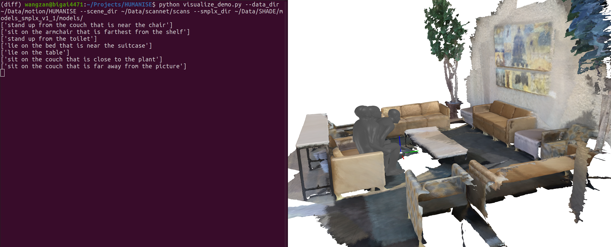

## A new format for using HUMANISE easier

### Data

We have re-formatted the data for using HUMANISE easier. The re-formatted data can be downloaded from original download link. Please refer to this [link](https://docs.google.com/forms/d/e/1FAIpQLSfzhj2wrRLqAXFVOTn8K5NDN-J_5HueRTohMAlayqBuPPWA1w/viewform?usp=sf_link) if you are the first time to use HUMANISE.

Currently, you just need to download the the `motions.zip` and `annotation.csv` files. The `motions.zip` contains the motion sequence data, and the `annotation.csv` contains the annotations for the motion data.

Unzip the `motions.zip` file, and you will get the following folder structure:

```bash
-| motions
---| 000000.pkl
---| ...
```

Each `*.pkl` store a tuple, in which the first item is numpy array with `<L, 159>` shape size storing (trans, orient, body_pose, hand_pose) parameters and the second item is also a numpy array with `<10, >` shape size storing the betas parameters.

The `annotation.csv` file contains the annotations for the motion data. The content of this file is as follows:

```bash
motion_id,scene_id,scene_trans_x,scene_trans_y,scene_trans_z,object_id,object_label,object_semantic_label,action,text
000000,scene0000_00,-4.11121502,-4.17789347,-0.06122726,37,bed,4,lie,lie on the bed
...
```

### How to use?

Please refer the [`visualize_demo.py`](../visualize_demo.py) for more details.

Run the following script to visualize the motion data.

```bash
python visualize_demo.py --data_dir ${HUMANISE}$ --scene_dir ${SCANNET}$ --smplx_dir ${SMPLX}$
```



### Re-format

Download the `align_motion_release` and `pure_motion`, and put them into the `${HUMANISE}$` folder. Then, run the following script to re-format the data.

```bash
python re-format.py --data_dir ${HUMANISE}$ --save_dir ${REFORMAT}$
```

